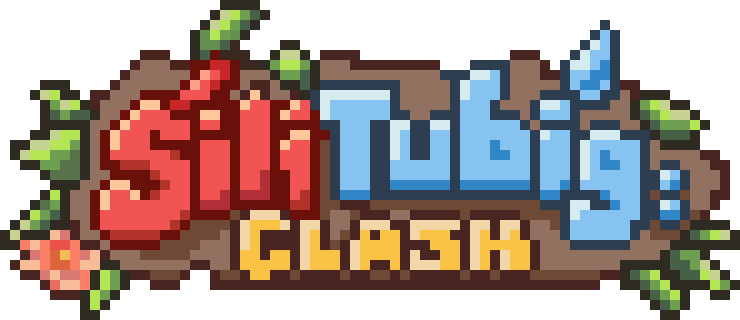

<p align="center">
  
</p>

<p align="center">
  
  
  
</p>

# Sili-Tubig Clash

**Sili-Tubig Clash** is a local-network multiplayer party game built in Godot,
based on the Filipino playground game **Sili-Sili Maanghang Tubig-Tubig
Malamig**. One **Sili** hunts four **Tubig** across a shared map; a tag burns
a Tubig in place, and a teammate has to reach them and channel a rescue before
their time runs out. Get caught enough times and it's over for you — for the
round, not the series.

Built by **F.I.R.E.S DEV** (University of La Salette, Inc. — College of
Information Technology) for **CODE & CONQUER Cagayan Valley: E-Sports Game
Dev Challenge** (RSTW 2026, DOST Region 2).

## Who it's for

- **Players** — groups of up to 5 on the same Wi-Fi/LAN who want a quick,
  couch-multiplayer-style party game without needing internet or a dedicated
  server.
- **Judges/evaluators** of the competition this was built for — see
  [Build status](#build-status) and [Known issues](#known-issues) below for
  an honest account of what's finished versus in progress.
- **Contributors** — see [CONTRIBUTING.md](CONTRIBUTING.md) for the
  development workflow.

## How a match works

- **Series of 5** — a full series is five rounds, one per player, so everyone
  takes a turn as the Sili exactly once.
- **Scoring** — both roles score, and the ceilings are close so no single round
  decides the series:

  | Role | Award | Points |
  |---|---|---|
  | Sili | per Tubig eliminated | 2 |
  | Sili | full wipe bonus | +3 |
  | Tubig | survived to the buzzer | 3 |
  | Tubig | per completed rescue | 1 |

  Standings appear after every round on a persistent leaderboard, not just at
  the end.
- **Rescues** — a burning Tubig is rooted but not out; a teammate holds the
  rescue key nearby to bring them back. Two teammates can channel the same
  rescue at once, and the furthest-along one determines the countdown shown.
- **Eliminated players spectate** — cycle between the Sili and any living
  Tubig with a follow camera instead of staring at your own frozen sprite for
  the rest of the round.
- **Canopy cover** — trees and foliage hide players from the minimap while
  they're underneath, so the map isn't a permanent radar.
- **Fountain powerup** — a map hazard/pickup with its own state and visual
  tint, part of the round's terrain rather than a menu option.
- **Practice Match** — unranked, 2+ players, random Sili, for a casual round
  that doesn't pollute series standings.

## Development environment

| Category | Details |
|---|---|
| Engine | Godot **4.7**, GL Compatibility renderer |
| Language | GDScript |
| Networking | Godot's built-in `ENetMultiplayerPeer`, LAN UDP broadcast for lobby discovery |
| Platforms targeted | Windows, macOS, Android, iOS (Web export is not yet functional — see [Known issues](#known-issues)) |
| External tooling | Python 3 + numpy/scipy, **only** for regenerating the synthesised audio (`tools/generate_audio.py`) — the game itself has no runtime dependency on Python |
| Version control | Git, hosted on [GitHub](https://github.com/nncast/godot-sili-tubig-clash) |

## Project structure

```
autoloads/       Global singletons — network manager, match/series state, game
                 settings, audio, leaderboard, modal dialog
game/arena/      Match gameplay: actors (Sili, Tubig), the arena scene and HUD logic
ui/
  title_screen/  Host/join, lobby entry, leaderboard, credits
  settings/      Volume, player name, touch controls, credits
  credits/       Reusable in-game credits/about panel
  mobile/        Touch control overlay
  hud/           In-match HUD, spectator camera, minimap
  lobby/         Pre-match lobby screen
tools/           Headless test harnesses and dev scripts (see Testing)
maps/            Level data (currently: Boracay)
build/           Tracked, prebuilt binaries per platform
```

## Setup and run instructions

Requires **Godot 4.7**.

1. Clone the repo.
2. Open `project.godot` in Godot.
3. Run the project — it boots to the title screen (`ui/title_screen/title_screen.tscn`).

To play a match, one device **hosts** (Title Screen → Host), which opens the
game on port `7777` and starts advertising a 4-digit lobby code on port
`7778`. Everyone else **joins** either by that code (LAN broadcast lookup),
by "Auto Join" (connects to whichever host answers first), or by typing the
host's IP address directly — shown on the host's lobby screen, and the
reliable fallback on networks that block UDP broadcast (phone hotspots, guest
Wi-Fi, some routers, and NAT'd Android emulators like BlueStacks). All
devices must be on the **same local network**; there is no internet
relay/matchmaking server.

Prebuilt binaries for Windows, macOS and Android are tracked under
[`build/`](build). To produce your own, use Godot's Export dialog with the
presets in `export_presets.cfg`.

## Controls

| Action | Keyboard | Notes |
|---|---|---|
| Move | `WASD` / Arrow keys | |
| Sprint | `Shift` | Draws from a stamina bar |
| Rescue / Interact | `E` | Hold near a burning teammate |
| Struggle | `Space` | |
| Controls guide | `F1` or `H` | Toggles the in-game help panel |

On a touchscreen device, a **touch overlay** (movement stick + action buttons)
appears automatically and drives the same input actions — no separate control
scheme to learn. It can be switched off or made more opaque from Settings.

## Completed features

- Host/join multiplayer over LAN, with lobby-code discovery, auto-join, and
  an IP-address fallback for networks that drop broadcast traffic
- Server-authoritative tag/rescue/elimination logic, validated against
  distance and role so a modified client can't forge a tag or a free rescue
- Shared rescue progress bar that tracks each rescuer independently (fixed in
  0.3.0 — two teammates channeling the same rescue no longer fight over one
  display)
- Series rotation (everyone is Sili exactly once) with cumulative scoring and
  a persistent, locally-saved leaderboard
- Spectator camera for eliminated players
- Canopy stealth (minimap visibility tied to cover) and the fountain powerup
- Mobile touch controls, auto-enabled on touchscreen devices, configurable in Settings
- In-game Credits/About screen (title screen and Settings), satisfying the
  BoldPixels font's CC BY-SA attribution requirement
- Synthesised, from-scratch audio for every footstep and gameplay SFX
  (`tools/generate_audio.py`) — no third-party sample libraries used

## Incomplete / planned features

- **Solo/offline practice mode with a bot Sili** — right now a judge or
  player opening the app alone reaches a lobby they can't play in; see
  [Next development steps](#next-development-steps)
- **Web export** — `ENetMultiplayerPeer` and UDP broadcast discovery don't
  run in a browser; this needs a `WebSocketMultiplayerPeer` transport
- **Mid-match disconnect/reconnect** — a dropped player is currently removed
  for the round, with no rejoin path back into the same match
- Additional maps beyond the single current level (Boracay)
- A Filipino cultural art pass on the tilemap
- A trailer

## Build status

| Platform | Status |
|---|---|
| Windows | Builds and runs; binary tracked in `build/windows/` |
| macOS | Builds and runs; binary tracked in `build/macos/` |
| Android | Builds and runs as of 0.4.0 — earlier exports were missing the `INTERNET`/Wi-Fi permissions Android requires for any networking, which silently broke both hosting and joining (see [Known issues](#known-issues)) |
| iOS | Export preset configured (local-network usage description, Wi-Fi capability) but not yet built/tested on a device |
| Web (HTML5) | **Not functional for multiplayer** — exports, but cannot host or join a match; see Incomplete features above |

## Known issues

- **Android/BlueStacks networking (fixed 0.4.0, re-export required).** Older
  Android builds couldn't host or join because the exported APK requested no
  network permissions at all. Fixed in `export_presets.cfg`; any APK built
  before this version needs to be re-exported.
- **Emulator networking topology.** Even with permissions correct, Android
  emulators (BlueStacks, etc.) sometimes run on a NAT'd virtual adapter
  isolated from the host machine's real LAN, which can prevent UDP broadcast
  discovery from finding a desktop host. Set the emulator's network mode to
  "Bridged" if available, or use **Join by IP** with the host's LAN IP shown
  on their lobby screen — that path doesn't depend on broadcast at all.
- **Broadcast discovery is best-effort in general.** Some routers and phone
  hotspots silently drop broadcast packets. The IP-address join fallback
  above covers this on any network.
- **Rescue feed line can precede validation.** `_complete_rescue()` posts
  "X rescued Y" to the event feed before the server finishes validating the
  rescue, so a rejected rescue can print a false line. Cosmetic only — it
  doesn't affect match state.

## Authorized assets

Every third-party asset (art, fonts, audio) and its licence is listed in
[**CREDITS.md**](CREDITS.md), the authoritative attribution record. The same
information — including the CC BY-SA-required BoldPixels font credit — is
also reachable in-game via the **About** button on the title screen and in
Settings.

## Next development steps

- **New maps** — the arena/map system (`maps/map_registry.gd`) already
  supports multiple levels; only Boracay currently exists. Additional maps
  are the most direct way to add replay value.
- **AI (bot Sili)** — a simple pathing/chase AI standing in for the Sili
  would unlock a solo practice mode, letting a single player (or a judge
  running the game alone) actually play a round instead of sitting in an
  unfillable lobby.
- **WebSocket multiplayer transport** — to make the Web export playable,
  replacing/supplementing `ENetMultiplayerPeer` for that platform.
- **Reconnect handling** — let a disconnected player rejoin a match already
  in progress instead of being dropped for the round.
- iOS device testing, a cultural art pass, and a trailer (see Incomplete
  features above).

## Testing

Headless test harnesses live under `tools/` and run without opening the
editor:

```bash
godot --headless --script res://tools/test_series.gd
godot --headless --script res://tools/test_heat.gd
godot --headless --script res://tools/test_scenes.gd
```

These cover series rotation/scoring, the life/rescue economy, and scene
instantiation, among others in the same directory.
